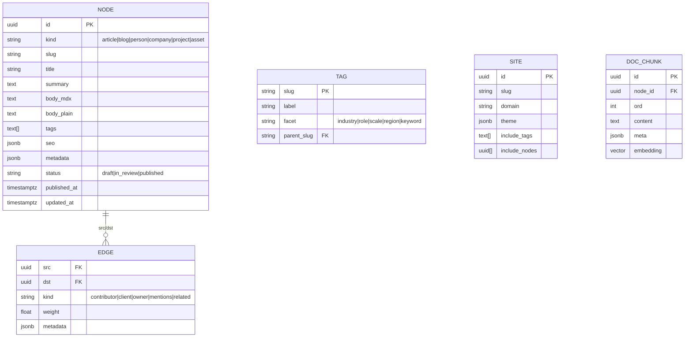
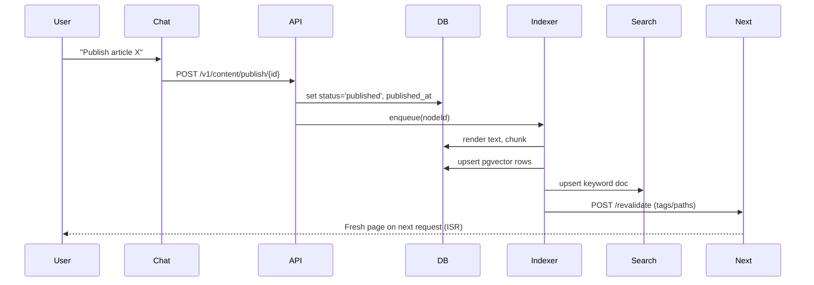
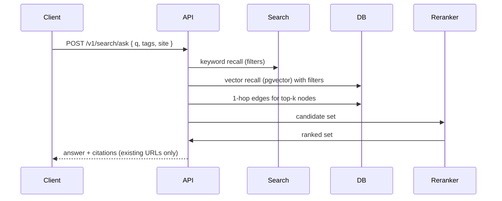

# 010 — Architecture Overview

> Platform: Multi-tenant corporate portfolio sites with tag-driven views, chat-only CMS, knowledge graph, hybrid search/RAG, and MCP integrations.

---

## 1. Goals & Non-Goals

### Goals
- **Single corpus → many sites**: People/Companies/Projects/Articles reused across multiple branded domains via tags/relations.
- **Chat-only CMS**: Content creation/editing/publishing via conversational tools (no GUI required).
- **Enterprise UX**: Fast, accessible, SEO-strong sites using proven, beautiful templates.
- **Knowledge-ready**: Store relations and embeddings to power search and Ask-the-site Q&A.
- **Low ops, high reliability**: Simple deployments, strong observability, clear failure modes.

### Non-Goals
- Full marketing automation (email campaigns, lead scoring).
- Heavy DXP personalization beyond tag-based filtering (can be added later).

---

## 2. High-Level Architecture

```mermaid
graph TD
  subgraph Web Tier
    User[Visitor/Editor] --> NextJS[Next.js (Vercel, ISR)]
  end

  subgraph API & Services
    Chat[Chat Agent UI] -->|Tools| API[CMS/API Layer (Strapi or Nest)]
    API --> DB[(Postgres + pgvector)]
    API --> Storage[(S3/GCS)]
    API --> Search[(Typesense / OpenSearch)]
    API --> MCP[MCP Server]
    API --> Reval[Revalidate Service]
    Indexer[Indexing Service]
  end

  subgraph Data Plane
    Indexer --> DB
    Indexer --> Search
    Indexer --> VectorDB[(pgvector in Postgres)]
  end

  NextJS <-->|SSR/ISR| API
  Chat -->|Propose/Validate/Upsert/Publish| API
  MCP -->|searchDocuments/getNode/ask| API
  API -->|Webhook on publish| Indexer
  Indexer -->|events| Reval
  Reval --> NextJS
```

**Key flows**
- **Publishing**: Chat → API (`upsert`, `publish`) → Indexer (chunk, embed, index) → Revalidate (ISR) → Fresh pages.
- **Ask**: Client → API `/v1/search/ask` → (keyword + vector + 1-hop graph) → rerank → answer + citations.

---

## 3. Components

### 3.1 Frontend (Next.js 14, App Router, ISR)
- Multi-domain routing; domain maps to `Site` (theme + default tags).
- Pages: Home, Solutions, Industries, Case Study, Blog, Article, Team, Contact, Tag routes (`/t/ai+fintech`).
- ISR with **revalidate-by-tag** for fast, targeted cache refresh.
- UI kits: Tailwind UI + shadcn/ui (marketing + app primitives).

### 3.2 CMS/API Layer (Strapi or NestJS)
- Exposes endpoints for Node/Edge/Tag/Site operations.
- Validates schema, tags, slugs; manages revisions and status (`draft`, `in_review`, `published`).
- Webhooks on publish → Indexer job + Revalidate.

### 3.3 Indexer Service
- On publish/update: render plaintext → chunk → compute embeddings → upsert `document_chunks` (pgvector) and keyword index (Typesense/OpenSearch).
- Emits revalidation events by **affected tags/paths**.

### 3.4 Search
- **Keyword**: Typesense/OpenSearch (BM25, filters, facets).
- **Vector**: pgvector (cosine) in Postgres; filtering by `kind`, `tags`, `site` defaults.

### 3.5 MCP Server
- Exposes tools: `searchDocuments`, `getNode`, `getRelated`, `getChunks`, `ask`, `publishWebhook`.
- Secured with tokens; rate-limited.

### 3.6 Storage
- S3/GCS for assets (images, PDFs). Auto WebP/AVIF variants; CDN fronted.

---

## 4. Data Model (Logical)



**Indexes**
- `unique(kind, slug)` on `nodes`.
- GIN on `nodes.tags`, `nodes.metadata`.
- `ivfflat` on `document_chunks.embedding` (cosine).

---

## 5. API Surface

- Human-readable: `docs/specs/030-api-spec.md`
- Machine-readable: `/openapi/chatcms-api.yaml` (OpenAPI 3.1)

Key endpoints:
- Content: `/v1/content/propose|validate|upsert|preview|publish|diff`
- Graph: `/v1/graph/edges`, `/v1/graph/related/{id}`
- Search: `/v1/search/list`, `/v1/search/ask`
- System: `/v1/system/revalidate`, `/v1/system/health`

---

## 6. Core Sequences

### 6.1 Publish Sequence


### 6.2 Ask (Hybrid RAG)


---

## 7. Caching & Performance

- **ISR**: Page-level caching; revalidate by **tag** and **path** on publish.
- **API caching**: Short-lived CDN cache for list endpoints with tag keys.
- **Images**: Next/Image or CDN transforms (WebP/AVIF, responsive sizes).
- **Perf targets**: LCP < 2.0s on 4G; p95 API latency < 200ms.

---

## 8. Security

- **Auth**: JWT bearer; issuer/audience validated.
- **RBAC**: Viewer, Editor, Publisher, Admin.
- **Visibility**: `public|unlisted|private` enforced in all queries.
- **Headers**: HSTS, CSP (strict-dynamic where feasible), X-Frame-Options deny, Referrer-Policy strict-origin-when-cross-origin.
- **Secrets**: Vault/Secret Manager; no secrets in repo.
- **Audit**: All writes logged with actor + diff hash.

---

## 9. Observability

- **Metrics**: p50/p95 latency, error rate, indexer lag, cache hit rate.
- **Logs**: structured (JSON); correlation IDs (traceId).
- **Tracing**: OpenTelemetry across API & Indexer.
- **Alerts**: 5xx rate spikes, indexer backlog, revalidation failures.

---

## 10. Deployment & Environments

- **Envs**: `dev` → `staging` → `prod`.
- **Hosting**: Vercel (Next.js), Cloud Run or container VM (API/Indexer/MCP), Neon/Supabase (Postgres), S3/GCS (assets), Typesense/OpenSearch (search).
- **CI/CD**: Lint → Typecheck → Unit → e2e/Playwright → Lighthouse CI → Deploy preview → Promote.
- **Migrations**: Prisma/Flyway; backwards compatible first.

---

## 11. Scalability & Sizing (initial)

- **Throughput**: O(10^4–10^5) page views/day comfortably on ISR.
- **Search**: Typesense cluster of 3 small nodes; shard on kind if needed.
- **Vector**: ivfflat index with list count tuned for corpus size; keep chunk size ~1k chars.
- **DB**: Read replicas for heavy read traffic; pgbouncer pooler.

---

## 12. Risks & Mitigations

- **R1**: Tag sprawl → taxonomy governance, tag whitelist tool, audits.
- **R2**: Content quality via chat → strict validation & review workflow.
- **R3**: SEO duplication on tag combos → canonicalization & whitelist of indexable combos.
- **R4**: Embedding drift/model changes → store model/version; batch re-embed job.
- **R5**: Vendor lock-in → abstract search & vector behind service interface.

---

## 13. Open Questions

- Do we need **per-site** custom components beyond theming? (If yes, module federation or runtime slots.)
- Do we require **fine-grained approvals** (legal/compliance) before publish? (Add reviewer policies.)
- Which **LLM provider** and context window targets for `/ask` v1?

---

## 14. References

- API details: [`docs/specs/030-api-spec.md`](./030-api-spec.md)  
- OpenAPI: `/openapi/chatcms-api.yaml`  
- User Stories: [`docs/requirements/0002-user-stories.md`](../requirements/0002-user-stories.md)
