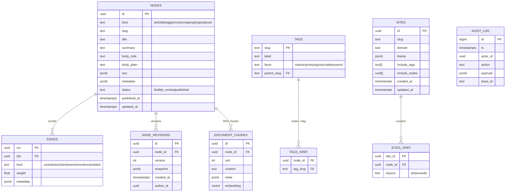

# 020 — Database Design (Postgres + pgvector)

> Scope: Multi-tenant corporate portfolio platform with chat-only CMS, knowledge graph, hybrid search/RAG, and MCP.  
> Engine: **Postgres 15+** with **pgvector**. Storage for assets in S3/GCS (not modeled here).

---

## 1. Design Goals

- **Single source of truth** for content nodes (articles/blogs/people/companies/projects/assets).
- **Explicit relationships** (edges) to support related content and graph-aware retrieval.
- **Tag-driven views** with faceted taxonomy (industry/role/region/scale/keyword).
- **High-quality publishing workflow** (draft/review/publish) with **revisions & audit**.
- **RAG-ready** via chunk store + embeddings in **pgvector**.
- **Fast listings** using proper indexes and partial materialization where needed.
- **Simple multi-tenancy** via `sites` (domain, theme, default filters).

---

## 2. Logical Model (ERD)



---

## 3. Physical Schema (summary)

### 3.1 `nodes`
- **Uniqueness**: `(kind, slug)` unique.
- **Status**: `draft|in_review|published`.
- **Visibility** (optional field): keep in `metadata.visibility` or add column if needed.
- **Indexes**:
  - `unique(kind, slug)`
  - `GIN` on `metadata`
  - (Optional) `btree` on `published_at` for recency sorts

### 3.2 `node_revisions`
- Immutable snapshots of each save; stores **entire node** as JSON for diffing.
- **Uniqueness**: `(node_id, version)`.

### 3.3 Tags
- `tags` (master), `tags_xref` (many-to-many).
- Facets: `industry|role|region|scale|keyword`.
- **Indexes**: PK on `tags.slug`, FK on xref; `btree` on facet for admin UIs.

### 3.4 Edges
- Directed edges with `kind` and optional `weight`.
- **Primary key**: `(src, dst, kind)` to keep them idempotent.
- **Use cases**: related widgets, graph expansion during retrieval.

### 3.5 Document chunks (RAG)
- ~800–1200 char chunks with ~100 char overlap.
- `embedding vector(1536)` (or per model).
- **Indexes**: `ivfflat` on `embedding vector_cosine_ops` (requires ANALYZE and list count tuning).

### 3.6 Sites & curation
- `sites` define domain, theme, default `include_tags`, and optional `include_nodes` pins.
- `sites_xref` allows explicit per-site curation (pin/exclude) in addition to tag filters.

### 3.7 Audit log
- Append-only; captures actor, action (propose/upsert/publish/diff/rollback), and payload hash/summary.

---

## 4. DDL Highlights
See the generated [`/db/schema.sql`](../../db/schema.sql) for complete SQL. Key points:
- `CREATE EXTENSION IF NOT EXISTS vector;`
- Constraints: FK ON DELETE CASCADE for dependent tables (revisions, chunks, tag xref).
- Idempotent upserts use `ON CONFLICT DO UPDATE` with checksum guards where appropriate.

---

## 5. Common Queries

### 5.1 Fetch nodes for a Site (tags + pins)
```sql
-- Params: :site_slug
with site as (
  select include_tags, include_nodes
  from sites where slug = :site_slug
)
select n.*
from nodes n, site s
left join sites_xref sx on sx.node_id = n.id and sx.site_id = (select id from sites where slug=:site_slug)
where n.status = 'published'
  and (
    n.id = any(s.include_nodes) OR
    exists (
      select 1 from tags_xref tx
      where tx.node_id = n.id and tx.tag_slug = any(s.include_tags)
    )
  )
  and coalesce(sx.reason, 'pin') != 'exclude'
order by n.published_at desc
limit 50;
```

### 5.2 List by tags and kind
```sql
-- :tags (text[]), :kinds (text[])
select n.id, n.kind, n.slug, n.title, n.summary
from nodes n
where n.status='published'
  and n.kind = any(:kinds)
  and exists (
    select 1 from tags_xref tx where tx.node_id = n.id and tx.tag_slug = any(:tags)
  )
order by n.published_at desc
limit 50;
```

### 5.3 Vector search with filters
```sql
-- :q_embedding vector, :k int, :tags text[], :kinds text[]
select d.node_id, n.kind, n.slug, n.title,
       1 - (d.embedding <=> :q_embedding) as score
from document_chunks d
join nodes n on n.id = d.node_id
where n.status = 'published'
  and n.kind = any(:kinds)
  and exists (select 1 from tags_xref tx where tx.node_id=n.id and tx.tag_slug = any(:tags))
order by d.embedding <=> :q_embedding
limit :k;
```

### 5.4 One-hop related
```sql
-- :node_id uuid, :kind text, :limit int
select n2.*
from edges e
join nodes n2 on n2.id = e.dst
where e.src = :node_id
  and ( :kind is null or e.kind = :kind )
  and n2.status = 'published'
limit :limit;
```

---

## 6. Performance Notes

- Maintain `ANALYZE` and `VACUUM` regularly; autovacuum tuned per table.
- For `ivfflat`, set `SET ivfflat.probes = 10` (tune per corpus); adjust `lists` on index creation.
- Consider **materialized views** for heavy home/landing pages (invalidate on publish).

---

## 7. Security & Governance

- **RBAC** enforced at API layer; optional Postgres RLS for read separation (not enabled by default).
- **Audit** every write path; include `trace_id` for request correlation.
- **PII**: discourage storage in nodes; if needed, isolate and encrypt columns.

---

## 8. Migration Strategy

- Use **Prisma/Flyway** with **forward-only** migrations in CI.
- Keep **backward-compatible** changes (add columns, not drop) until all services are updated.
- Large-scale re-embeds: batch jobs with progress table; dual-read strategy during reindex.

---

## 9. Future Extensions

- Mirror to **Neo4j** via CDC for deep graph analytics.
- Add **`visibility`** column if policy expands beyond `metadata`.
- Introduce **`locales`** table for i18n of titles/body (or store localized nodes per locale).
- Add **soft-delete** flags for recoverability.
